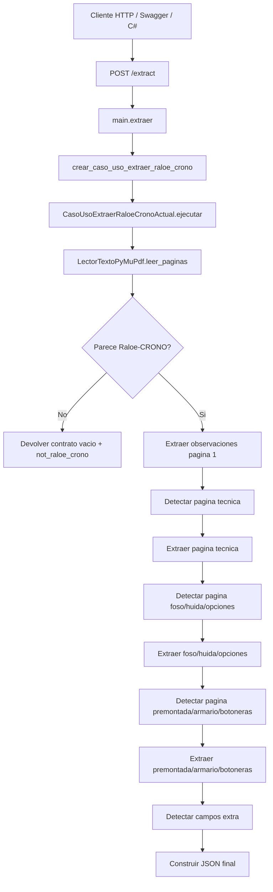
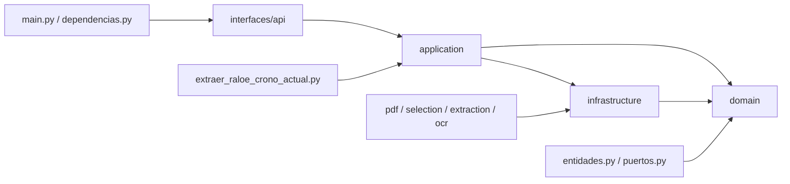
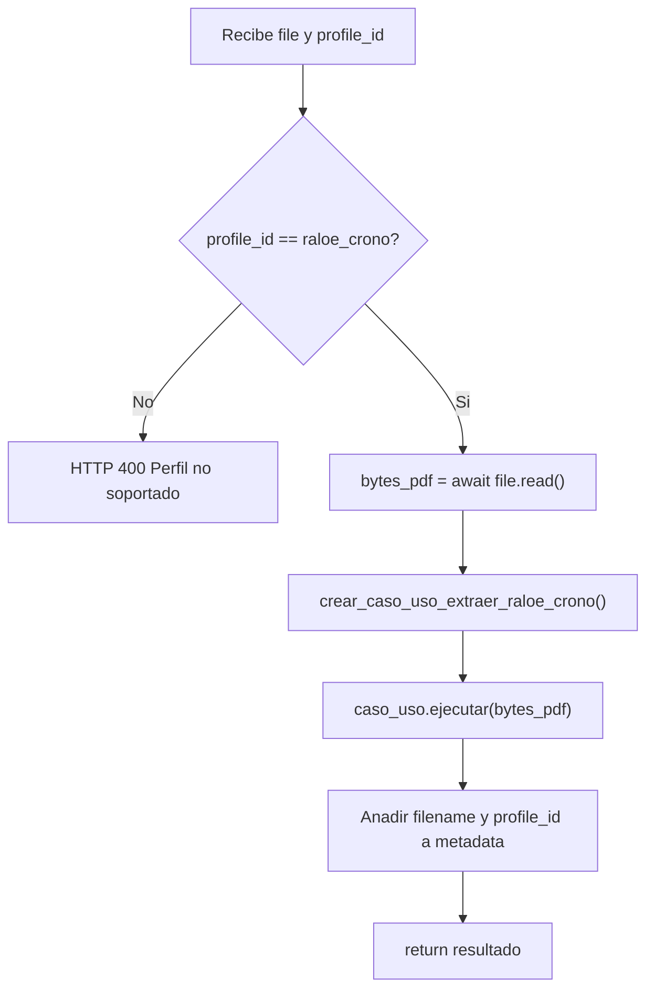
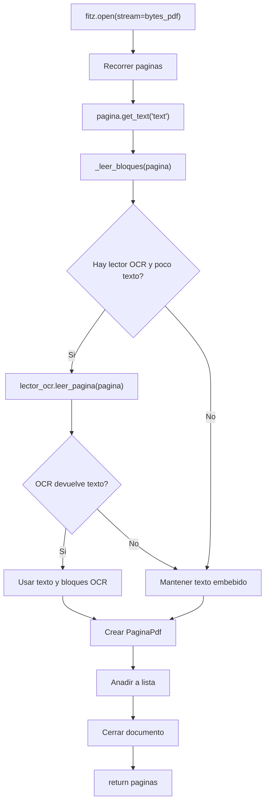
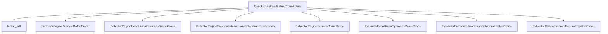
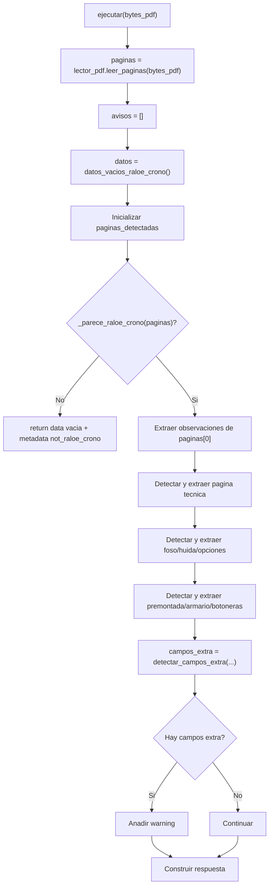
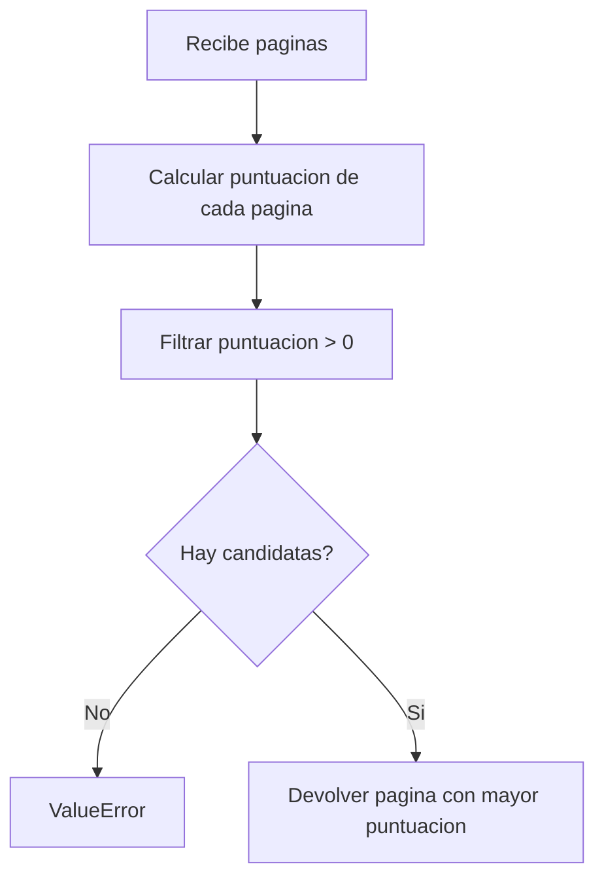
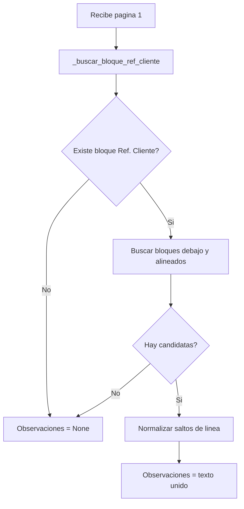
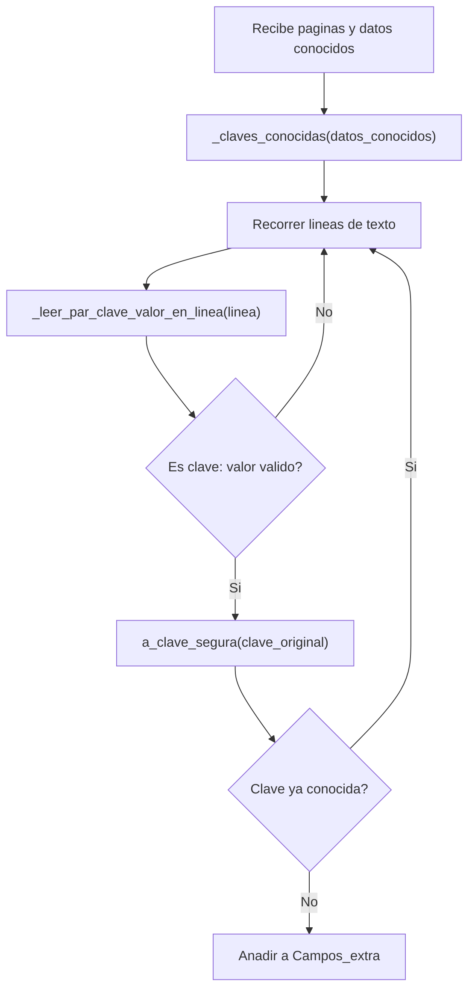
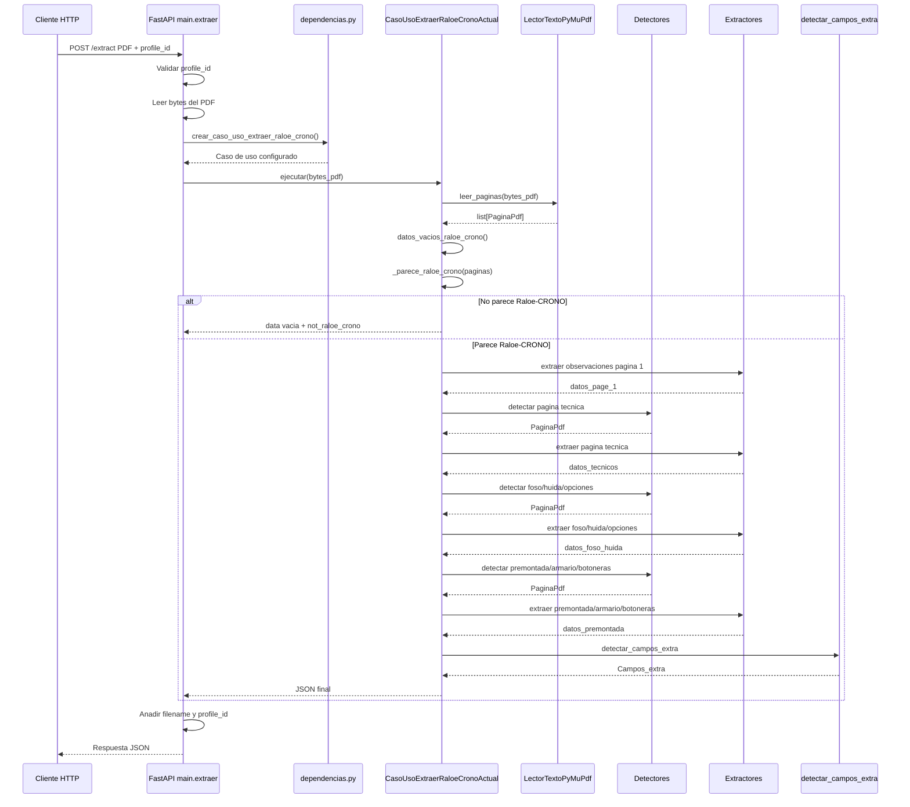

# Documentacion tecnica para programador - Extractor Raloe-CRONO

## 1. Objetivo del documento

Este documento explica el funcionamiento tecnico del extractor actual tomando como eje el unico caso de uso productivo que existe ahora mismo:

`CasoUsoExtraerRaloeCronoActual`

El objetivo es que un programador pueda entender:

- como entra una peticion HTTP en la API;
- como se construye el caso de uso;
- que dependencias intervienen;
- como se leen las paginas del PDF;
- como se decide si el PDF pertenece al perfil Raloe-CRONO;
- como se localizan las paginas utiles;
- como se extraen los datos;
- como se genera la respuesta JSON;
- que metodos participan en cada paso.

La documentacion se centra en el flujo actual. No describe una arquitectura futura ideal, sino lo que el proyecto hace ahora.


## 2. Vista general del flujo




## 3. Capas implicadas



### `interfaces/api`

Contiene la entrada HTTP de la aplicacion.

Archivos principales:

- `main.py`
- `dependencias.py`

### `application`

Contiene el caso de uso y logica de coordinacion.

Archivos principales:

- `extraer_raloe_crono_actual.py`
- `contrato_vacio.py`
- `campos_extra.py`

### `domain`

Contiene entidades y puertos.

Archivos principales:

- `entidades.py`
- `puertos.py`

### `infrastructure`

Contiene implementaciones concretas:

- lectura de PDF con PyMuPDF;
- OCR;
- detectores de paginas;
- extractores especificos de Raloe-CRONO.


## 4. Punto de entrada HTTP

Archivo:

`src/extractor_pdf/interfaces/api/main.py`

### 4.1. `app = FastAPI(...)`

Crea la aplicacion FastAPI.

```python
app = FastAPI(title=configuracion.nombre_app, version="0.1.0")
```

La variable `app` es la que usa Uvicorn para levantar el servidor:

```bash
uvicorn extractor_pdf.interfaces.api.main:app --reload
```


### 4.2. `health()`

Endpoint:

`GET /health`

Responsabilidad:

- comprobar que la API esta arrancada;
- devolver una respuesta minima.

Salida:

```json
{
  "status": "ok"
}
```

No participa en la extraccion.


### 4.3. `extraer(file, profile_id)`

Endpoint:

`POST /extract`

Entrada:

- `file`: PDF enviado por formulario multipart;
- `profile_id`: perfil de extraccion. Por defecto `raloe_crono`.

Flujo interno:



Responsabilidad:

- validar el perfil;
- leer los bytes del PDF;
- invocar el caso de uso;
- enriquecer `metadata`;
- devolver el resultado.

Importante:

`main.py` no sabe como se extraen los campos. Solo actua como adaptador HTTP.


## 5. Creacion de dependencias

Archivo:

`src/extractor_pdf/interfaces/api/dependencias.py`

### 5.1. `crear_caso_uso_extraer_raloe_crono()`

Responsabilidad:

- construir el caso de uso productivo;
- inyectar las dependencias tecnicas necesarias.

Codigo actual resumido:

```python
def crear_caso_uso_extraer_raloe_crono() -> CasoUsoExtraerRaloeCronoActual:
    return CasoUsoExtraerRaloeCronoActual(
        lector_pdf=LectorTextoPyMuPdf(lector_ocr=LectorOcrNulo()),
    )
```

Dependencias actuales:

- `CasoUsoExtraerRaloeCronoActual`
- `LectorTextoPyMuPdf`
- `LectorOcrNulo`

Interpretacion:

Actualmente el endpoint usa lectura directa del texto embebido del PDF. El OCR queda inyectado como nulo.

Si en el futuro se quiere usar OCR real desde el endpoint, este es uno de los puntos donde podria cambiarse la composicion.


## 6. Entidades de dominio

Archivo:

`src/extractor_pdf/domain/entidades.py`

### 6.1. `BloqueTexto`

Representa un bloque de texto extraido de una pagina.

Campos:

- `texto`
- `x0`
- `y0`
- `x1`
- `y1`

Uso:

Permite extraer informacion no solo por contenido textual, sino tambien por posicion.

Esto es importante porque algunos campos del formulario no tienen una etiqueta clara, pero aparecen en una zona concreta.


### 6.2. `PaginaPdf`

Representa una pagina ya leida del PDF.

Campos:

- `numero`
- `texto`
- `bloques`
- `metodo_extraccion`

Uso:

Es la entidad principal que viaja desde el lector PDF hasta detectores y extractores.


### 6.3. `PaginaRenderizada`

Representa una pagina convertida a imagen.

Campos:

- `numero_pagina`
- `bytes_imagen`
- `formato_imagen`
- `ancho`
- `alto`
- `dpi`

Uso:

Esta preparada para flujos visuales/OCR. No es la pieza central del endpoint actual, pero forma parte de la arquitectura para escenarios futuros.


## 7. Puertos de dominio

Archivo:

`src/extractor_pdf/domain/puertos.py`

Los puertos definen contratos abstractos. Permiten que la aplicacion no dependa directamente de una libreria concreta.

### 7.1. `LectorTextoPdf`

Metodo:

```python
leer_paginas(bytes_pdf: bytes) -> list[PaginaPdf]
```

Responsabilidad:

- recibir bytes de un PDF;
- devolver una lista de paginas del dominio.

Implementacion actual:

- `LectorTextoPyMuPdf`


### 7.2. `LectorOcr`

Metodo:

```python
leer_pagina(pagina: object) -> tuple[str, list]
```

Responsabilidad:

- leer una pagina mediante OCR;
- devolver texto y bloques.

Implementacion actual usada en la API:

- `LectorOcrNulo`


### 7.3. `RenderizadorPaginaPdf`

Metodo:

```python
renderizar_pagina(bytes_pdf: bytes, numero_pagina: int, dpi: int = 200) -> PaginaRenderizada
```

Responsabilidad:

- convertir una pagina de PDF a imagen.


### 7.4. `ExtractorVisualPagina`

Metodo:

```python
extraer(pagina_renderizada: PaginaRenderizada, cliente_id: str) -> dict
```

Responsabilidad:

- extraer informacion desde una pagina renderizada.

Este puerto esta pensado para estrategias visuales/OCR.


## 8. Lectura del PDF

Archivo:

`src/extractor_pdf/infrastructure/pdf/lector_pymupdf.py`

Clase:

`LectorTextoPyMuPdf`

### 8.1. `__init__(lector_ocr=None)`

Responsabilidad:

- recibir opcionalmente un lector OCR;
- guardarlo para usarlo si una pagina tiene poco texto embebido.


### 8.2. `leer_paginas(bytes_pdf)`

Responsabilidad:

- abrir el PDF con PyMuPDF;
- recorrer pagina por pagina;
- extraer texto plano;
- extraer bloques posicionados;
- usar OCR si procede;
- devolver una lista de `PaginaPdf`.

Flujo:



Detalle importante:

El OCR solo se usa si:

- existe `lector_ocr`;
- el texto embebido de la pagina tiene menos caracteres que el umbral configurado.

En la API actual se inyecta `LectorOcrNulo`, por lo que no hay OCR real en la extraccion principal.


### 8.3. `_leer_bloques(pagina)`

Responsabilidad:

- leer bloques de texto con coordenadas;
- limpiar bloques vacios;
- devolver una lista de `BloqueTexto`.

Cada bloque contiene:

- texto;
- coordenada izquierda (`x0`);
- coordenada superior (`y0`);
- coordenada derecha (`x1`);
- coordenada inferior (`y1`).

Los extractores usan estas coordenadas para buscar valores en zonas concretas.


## 9. Caso de uso principal

Archivo:

`src/extractor_pdf/application/extraer_raloe_crono_actual.py`

Clase:

`CasoUsoExtraerRaloeCronoActual`

Esta clase coordina toda la extraccion. Es el centro del flujo actual.


### 9.1. Dependencias del caso de uso




### 9.2. `__init__(...)`

Responsabilidad:

- recibir dependencias desde fuera;
- crear implementaciones por defecto cuando no se reciben;
- permitir tests o futuras variantes inyectando detectores/extractores distintos.

Parametros principales:

- `lector_pdf`
- `detector_page_tecnica`
- `detector_page_foso_huida`
- `detector_page_premontada`
- `extractor_tecnico`
- `extractor_foso_huida`
- `extractor_premontada`
- `extractor_observaciones`

Patron usado:

```python
self.detector_page_tecnica = detector_page_tecnica or DetectorPaginaTecnicaRaloeCrono()
```

Esto significa:

- si se recibe una dependencia, se usa;
- si no se recibe, se crea la dependencia por defecto.


### 9.3. `ejecutar(bytes_pdf)`

Responsabilidad:

- ejecutar el flujo completo de extraccion;
- devolver el JSON final.

Este es el metodo mas importante del caso de uso.

Flujo tecnico:



Pasos internos:

1. Lee paginas.
2. Crea lista de avisos.
3. Carga contrato vacio.
4. Inicializa metadatos de paginas detectadas.
5. Comprueba si parece Raloe-CRONO.
6. Extrae observaciones de pagina 1.
7. Detecta pagina tecnica.
8. Extrae pagina tecnica.
9. Detecta pagina foso/huida/opciones.
10. Extrae pagina foso/huida/opciones.
11. Detecta pagina premontada/armario/botoneras.
12. Extrae pagina premontada/armario/botoneras.
13. Detecta campos extra.
14. Construye respuesta final.


### 9.4. Gestion de errores parciales

Cada bloque tecnico se ejecuta dentro de un `try/except`.

Ejemplo conceptual:

```python
try:
    pagina_tecnica = detector.detectar(paginas)
    datos_tecnicos = extractor.extraer(pagina_tecnica)
except Exception as exc:
    avisos.append(...)
```

Esto significa que si una seccion no se puede detectar o extraer:

- no se rompe toda la respuesta;
- se mantiene el contrato vacio para esa parte;
- se anade un aviso en `metadata.warnings`;
- el estado final puede pasar a `partial`.

Esta decision encaja con la premisa del proyecto:

La API no debe fallar por ausencia parcial de campos o secciones.


### 9.5. Respuesta cuando no es Raloe-CRONO

Si `_parece_raloe_crono(paginas)` devuelve `False`, el caso de uso retorna:

```json
{
  "data": "... contrato vacio ...",
  "page_1": {
    "Observaciones": ""
  },
  "metadata": {
    "is_raloe_crono": false,
    "status": "not_raloe_crono",
    "warnings": ["No se detectaron señales suficientes de Raloe-CRONO."]
  }
}
```

No se lanza excepcion.


### 9.6. `_unir_en(destino, origen)`

Responsabilidad:

- unir los datos extraidos dentro del contrato completo.

Regla:

- si una clave existe en ambos diccionarios y ambos valores son diccionarios, se hace `update`;
- en caso contrario, se sobrescribe/asigna la clave.

Ejemplo:

```python
_unir_en(datos, datos_tecnicos)
```

Esto permite completar secciones del contrato vacio sin perder el resto del contrato.


### 9.7. `_unir_secciones(*partes)`

Responsabilidad:

- unir varios diccionarios y devolver uno nuevo.

Nota tecnica:

Actualmente no es el metodo central del flujo `ejecutar`, que usa principalmente `_unir_en`.

Podria revisarse en el futuro si queda sin uso real.


### 9.8. `_parece_raloe_crono(paginas)`

Responsabilidad:

- decidir si el documento tiene suficientes senales para considerarse Raloe-CRONO.

Funcionamiento:

1. Une el texto de las primeras paginas.
2. Busca senales conocidas.
3. Cuenta cuantas aparecen.
4. Devuelve `True` si aparecen al menos dos.

Senales actuales:

- `CRONO`
- `MANIOBRA CARLOS SILVA`
- `Tracción Eléctrica:`
- `Gestión foso / huida reducida:`
- `Premontada:`

Regla actual:

```python
sum(1 for senal in senales if senal in texto) >= 2
```

Ventaja:

- evita procesar PDFs totalmente ajenos.

Riesgo:

- si cambia mucho el formulario, puede no detectar el perfil aunque el documento sea del cliente.


### 9.9. `_paginas_detectadas(paginas, paginas_detectadas)`

Responsabilidad:

- obtener la lista de paginas que participaron en la extraccion;
- usarlas para buscar campos extra.

Funcionamiento:

1. Toma los numeros de pagina detectados en `metadata`.
2. Filtra la lista original de paginas.
3. Si no encuentra ninguna, devuelve todas las paginas.

Uso principal:

```python
detectar_campos_extra(_paginas_detectadas(...), datos)
```


## 10. Contrato vacio

Archivo:

`src/extractor_pdf/application/contrato_vacio.py`

### 10.1. `datos_vacios_raloe_crono()`

Responsabilidad:

- cargar el contrato JSON vacio de Raloe-CRONO;
- devolverlo como diccionario Python.

Archivo cargado:

`src/extractor_pdf/infrastructure/extraction/client_base/raloe_crono_empty_contract.json`

Motivo:

El extractor debe devolver siempre la misma estructura de datos, aunque falten paginas o campos.

Esto facilita el consumo desde C#.


## 11. Detectores de pagina

Archivo:

`src/extractor_pdf/infrastructure/selection/detectores_paginas_raloe_crono.py`

Los detectores resuelven un problema clave:

Las paginas importantes no siempre estan en el mismo numero de pagina.

Por eso no se debe asumir "pagina 5", "pagina 6" o "las tres ultimas". Se busca por contenido.


### 11.1. `DetectorPaginaTecnicaRaloeCrono.detectar(paginas)`

Responsabilidad:

- encontrar la pagina tecnica principal.

Funcionamiento:

1. Puntua cada pagina usando `_puntuar`.
2. Descarta paginas con puntuacion 0.
3. Si no hay candidatas, lanza `ValueError`.
4. Devuelve la pagina con mayor puntuacion.

Diagrama:




### 11.2. `DetectorPaginaTecnicaRaloeCrono._puntuar(pagina)`

Responsabilidad:

- asignar una puntuacion segun senales textuales.

Senales ponderadas:

- `DETALLE DE MATERIAL`
- `MANIOBRA CARLOS SILVA`
- `Serie:`
- `Normas:`
- `Características:`
- `Tracción Eléctrica:`
- `Puertas de Cabina Embarque 1:`
- `Tensión Línea / Motor:`

Algunas senales aparecen duplicadas con problemas de codificacion para tolerar textos mal decodificados.


### 11.3. `DetectorPaginaFosoHuidaOpcionesRaloeCrono.detectar(paginas)`

Responsabilidad:

- encontrar la pagina de foso, huida y opciones.

Criterio actual:

- contiene `Gestión foso / huida reducida:`;
- contiene `Limitador velocidad Cab:`.

Si no la encuentra, lanza `ValueError`.


### 11.4. `DetectorPaginaPremontadaArmarioBotonerasRaloeCrono.detectar(paginas)`

Responsabilidad:

- encontrar la pagina de premontada, armario y botoneras.

Criterio actual:

- contiene `Premontada:`;
- contiene `Botonera Cabina:`.

Si no la encuentra, lanza `ValueError`.


## 12. Extractor de observaciones

Archivo:

`src/extractor_pdf/infrastructure/extraction/client_base/extractor_observaciones_resumen.py`

Clase:

`ExtractorObservacionesResumenRaloeCrono`


### 12.1. `extraer(pagina)`

Responsabilidad:

- extraer las observaciones de la pagina resumen.

Funcionamiento:

1. Busca el bloque donde aparece `Ref. Cliente:`.
2. Si no existe, devuelve `Observaciones: None`.
3. Busca bloques situados debajo de ese bloque.
4. Filtra bloques alineados aproximadamente con la misma `x0`.
5. Une el texto candidato.
6. Devuelve la observacion o `None`.

Diagrama:




### 12.2. `_buscar_bloque_ref_cliente(pagina)`

Responsabilidad:

- recorrer los bloques de la pagina;
- devolver el primer bloque que contiene `Ref. Cliente:`.


### 12.3. `_normalizar_saltos_linea(valor)`

Responsabilidad:

- eliminar saltos de linea internos innecesarios;
- unir lineas con espacios;
- limpiar espacios sobrantes.


## 13. Extractor de pagina tecnica

Archivo:

`src/extractor_pdf/infrastructure/extraction/client_base/extractor_pagina_tecnica.py`

Clase:

`ExtractorPaginaTecnicaRaloeCrono`


### 13.1. `extraer(pagina)`

Responsabilidad:

- extraer los campos principales de la pagina tecnica.

Secciones que devuelve:

- `general`
- `Normas`
- `Caracteristicas`
- `Traccion_electrica`
- `Traccion_hidraulica`
- `Puertas_cabina_embarque_1`
- `Puertas_cabina_embarque_2`

Estrategia actual:

- busca valores usando coordenadas de bloques (`x0`, `y0`);
- interpreta checks mediante la marca `\x14`;
- normaliza algunos valores anadiendo unidades como `V`, `A`, `m/s`, `mm`;
- aplica reglas concretas para diferencias entre los PDFs actuales.

Ejemplo de extraccion por zona:

```python
valores_generales = self._valores_de_bloque(
    pagina,
    y_min=190,
    y_max=225,
    x_min=50,
    x_max=100,
)
```

Esto significa:

Busca textos en bloques cuya coordenada vertical y horizontal caen dentro de ese rango.


### 13.2. Tratamiento de checks

Constante:

```python
MARCA_CHECK = "\x14"
```

Metodo:

```python
_tiene_check(...)
```

Si la marca aparece dentro de una zona concreta, el valor se interpreta como `Si`.

Si no aparece, se interpreta como `No`.


### 13.3. `_valores_de_bloque(pagina, y_min, y_max, x_min, x_max)`

Responsabilidad:

- devolver todos los valores de texto que esten dentro de un rectangulo aproximado.

Filtra:

- lineas vacias;
- la marca de check.

Devuelve:

- lista de strings.


### 13.4. `_valores_de_rangos(pagina, y_min, y_max, rangos_x)`

Responsabilidad:

- leer valores de varios rangos horizontales en una misma franja vertical.

Uso:

Se utiliza para datos repetidos en columnas, por ejemplo puertas de cabina embarque 1 y 2.


### 13.5. `_tiene_check(pagina, y_min, y_max, x_min, x_max)`

Responsabilidad:

- comprobar si hay una marca de check dentro de una zona.

Devuelve:

- `True` si encuentra `MARCA_CHECK`;
- `False` en caso contrario.


### 13.6. `_si_no(valor)`

Responsabilidad:

- convertir booleanos Python en valores de negocio.

```python
True  -> "Si"
False -> "No"
```


## 14. Extractor de foso, huida y opciones

Archivo:

`src/extractor_pdf/infrastructure/extraction/client_base/extractor_foso_huida_opciones.py`

Clase:

`ExtractorFosoHuidaOpcionesRaloeCrono`


### 14.1. `extraer(pagina)`

Responsabilidad:

- extraer las secciones:
  - `Gestion_foso_huida_reducida`;
  - `Opciones`.

Estrategia:

- extrae algunos valores variables desde coordenadas;
- completa muchos campos con valores fijos conocidos del perfil actual;
- identifica una variante concreta del segundo PDF usando `Pesacargas_fabricante == "MICELECT"`.

Campos variables obtenidos por posicion:

- `Pesacargas_fabricante`
- `Tipo_pesacargas`
- `Modelo_pesacargas`
- `Tension_pesacargas`
- `Rescate`

Campos que cambian segun variante:

- `Cont_sobrevel_a_dist`
- `Modulo_ARM`
- `Modulo_DCI`

Nota tecnica:

Esta clase contiene logica determinista muy ligada a los dos formularios actuales.


### 14.2. `_valores_pagina(pagina)`

Responsabilidad:

- concentrar la extraccion de los pocos valores variables de esta pagina.

Usa `_valores` para leer zonas concretas.

Devuelve un diccionario con los valores necesarios para construir la respuesta.


### 14.3. `_valores(pagina, y_min, y_max, x_min, x_max)`

Responsabilidad:

- leer textos dentro de una zona aproximada;
- limpiar lineas vacias;
- ignorar marcas de check.

Es equivalente conceptualmente a `_valores_de_bloque` del extractor tecnico, pero definido localmente en este modulo.


## 15. Extractor de premontada, armario y botoneras

Archivo:

`src/extractor_pdf/infrastructure/extraction/client_base/extractor_premontada_armario_botoneras.py`

Clase:

`ExtractorPremontadaArmarioBotonerasRaloeCrono`

Constantes:

```python
MAX_PLANTAS_CRONO = 32
MAX_DISTANCIAS_ENTRE_NIVELES_CRONO = 31
```


### 15.1. `extraer(pagina)`

Responsabilidad:

- extraer las secciones:
  - `general`
  - `Premontada`
  - `Armario`
  - `Botonera_Exterior`
  - `Botonera_Cabina`

Estrategia actual:

- identifica la variante por el texto del display;
- construye listas normalizadas de 32 posiciones para campos de planta;
- construye listas de 31 posiciones para distancias entre niveles;
- completa campos fijos conocidos del perfil actual.

Deteccion de variante:

```python
es_segundo_pdf = valores["Texto_display"] == "ASCENSORES TECVALIFT,S.L."
```

Campos de longitud fija:

- `Piso_E1`
- `Piso_E2`
- `Acceso_E1`
- `Acceso_E2`
- `Display_modelo_E1`
- `Display_modelo_E2`
- `Orient_E1`
- `Orient_E2`
- `Secuencia`


### 15.2. `_valores_variante(pagina)`

Responsabilidad:

- devolver los valores variables segun la variante detectada.

Criterio actual:

- si el texto contiene `ASCENSORES TECVALIFT,S.L.`, usa los valores del segundo PDF;
- si no, usa los valores del primer PDF.

Nota tecnica importante:

Este metodo no esta extrayendo todos esos valores dinamicamente desde coordenadas. Actualmente actua como una tabla determinista para las variantes conocidas.

Esto funciona para los PDFs actuales, pero sera uno de los puntos a evolucionar si se quiere soportar muchos formularios cambiantes.


### 15.3. `_lista_fija(valores, longitud_objetivo)`

Responsabilidad:

- completar una lista hasta una longitud fija usando `-`;
- devolverla como string separado por comas.

Ejemplo:

```python
_lista_fija(["B", "1", "2", "3", "4"], 32)
```

Resultado:

```text
B,1,2,3,4,-,-,-,-,-,-,-,-,-,-,-,-,-,-,-,-,-,-,-,-,-,-,-,-,-,-,-
```

Motivo:

La familia CRONO tiene limite de 32 plantas.


## 16. Campos extra

Archivo:

`src/extractor_pdf/application/campos_extra.py`

### 16.1. `detectar_campos_extra(paginas, datos_conocidos)`

Responsabilidad:

- buscar pares `clave: valor` en las paginas procesadas;
- descartar claves que ya existen en el contrato;
- devolver un diccionario con campos no contemplados.

Flujo:




### 16.2. `a_clave_segura(clave_original)`

Responsabilidad:

- convertir una etiqueta del PDF en una clave segura para JSON/C#.

Transformaciones:

- quita acentos;
- sustituye caracteres no alfanumericos por `_`;
- compacta guiones bajos repetidos;
- elimina guiones bajos al principio/final;
- si empieza por numero, antepone `Campo_`.


### 16.3. `_leer_par_clave_valor_en_linea(linea)`

Responsabilidad:

- detectar si una linea tiene forma `clave: valor`.

Descarta:

- lineas sin exactamente un `:`;
- claves vacias;
- valores vacios;
- claves numericas;
- `PEDIDO CON OBSERVACIONES`;
- claves demasiado largas;
- valores que terminan en `:`.


### 16.4. `_claves_conocidas(datos)`

Responsabilidad:

- recorrer recursivamente el contrato actual;
- generar un conjunto de claves conocidas normalizadas.

Esto evita que un campo ya esperado se duplique dentro de `Campos_extra`.


### 16.5. `_clave_normalizada(clave)`

Responsabilidad:

- convertir una clave en formato comparable;
- usa `a_clave_segura`;
- aplica `casefold`.


### 16.6. `_quitar_acentos(texto)`

Responsabilidad:

- eliminar marcas diacriticas de un texto usando `unicodedata`.


## 17. Respuesta final del caso de uso

El metodo `ejecutar` devuelve un diccionario con esta forma:

```json
{
  "data": {},
  "page_1": {},
  "page_5": {},
  "page_6": {},
  "page_7": {},
  "metadata": {}
}
```

Las claves `page_5`, `page_6` y `page_7` son dinamicas.

Si en otro PDF la pagina tecnica esta en la 4, se devolvera `page_4`.

### 17.1. `data`

Contiene el contrato completo.

Es la parte principal para consumo desde C#.

### 17.2. `page_1` y paginas tecnicas

Sirven para trazabilidad y depuracion.

Permiten saber que datos salieron de cada pagina detectada.

### 17.3. `metadata`

Contiene informacion tecnica:

- paginas detectadas;
- si parece Raloe-CRONO;
- estado;
- avisos;
- nombre de archivo;
- perfil utilizado.


## 18. Diagrama de secuencia completo




## 19. Puntos tecnicos delicados del flujo actual

### 19.1. Dependencia de coordenadas

Varios extractores usan rangos `x/y` para localizar valores.

Ventaja:

- funciona bien con formularios estables.

Riesgo:

- si el layout se mueve mucho, el valor puede caer fuera del rango esperado.


### 19.2. Valores fijos y variantes conocidas

Algunos campos se devuelven como valores fijos porque en los PDFs actuales son constantes.

Ventaja:

- permite cerrar el contrato actual con precision.

Riesgo:

- si aparece una variante nueva, puede requerir evolucionar el extractor.


### 19.3. OCR no activo en el endpoint principal

El proyecto tiene piezas para OCR, pero el endpoint actual usa lectura directa de texto PDF.

Ventaja:

- mas rapido y fiable cuando el PDF contiene texto embebido.

Riesgo:

- si llega un PDF escaneado como imagen, la extraccion principal podria no obtener texto suficiente.


### 19.4. Deteccion de perfil por senales

`_parece_raloe_crono` exige al menos dos senales conocidas.

Ventaja:

- evita procesar documentos que no son del perfil.

Riesgo:

- un formulario antiguo o muy cambiado podria quedar fuera.


## 20. Resumen para programador

El nucleo tecnico esta en:

`CasoUsoExtraerRaloeCronoActual.ejecutar`

Este metodo no extrae todos los campos directamente. Coordina piezas especializadas:

- un lector de PDF;
- detectores de paginas;
- extractores por tipo de pagina;
- contrato vacio;
- detector de campos extra;
- construccion de respuesta final.

La API es una capa fina.

La lectura de PDF esta aislada detras del puerto `LectorTextoPdf`.

Los datos se mueven principalmente como `PaginaPdf`.

Los extractores actuales son deterministas y estan ajustados al perfil Raloe-CRONO actual.

La respuesta busca ser estable para C#:

- misma estructura;
- campos no encontrados como vacios;
- avisos en metadata;
- campos nuevos en `Campos_extra`;
- sin errores por ausencia parcial de informacion.
